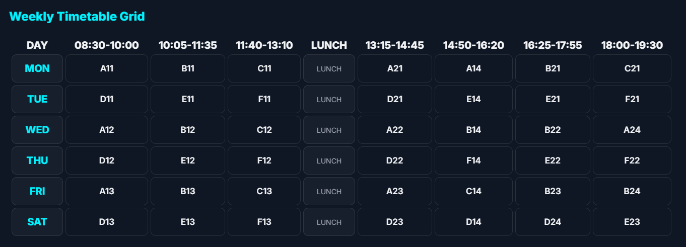

# FFCS Planner - VITB
A high-performance, interactive web application designed to help VIT Bhopal students plan their course schedules efficiently during the Fully Flexible Credit System (FFCS) registration.

Website link - [www.ffcsplannervitb.com](https://ffcsplannervitb.vercel.app/)

### Project Preview:


### About:
The **FFCS Planner - VITB** is a specialized tool built to simplify the complex process of timetable creation. It allows students to visualize their weekly schedule, manage credit limits, and detect slot clashes in real-time. The application is designed with a "Neon-Dark" aesthetic to provide a modern, developer-centric user experience while ensuring registration is error-free.

### Key Features:
* **Three-Draft System**: Save and switch between three different schedule versions (Draft 1, 2, and 3) to compare different faculty or slot combinations.
* **Smart Slot Management**: Real-time detection of slot clashes (e.g., C11 vs A21) to prevent registration errors.
* **Building Change Detection**: Automatically marks "Sprint" warnings (🏃‍♂️) when consecutive classes are in different buildings (e.g., moving from AB-1 to LC).
* **Dynamic Dashboard**: Live counters for total credits (max 29) and total registered courses.
* **Draft Sharing Logic**: Generate a unique URL to share your entire planned draft with friends instantly.
* **Export Options**: One-click export of your final timetable grid as a high-quality PNG or PDF.
* **Dark/Light Modes**: Customizable UI themes for comfortable planning during late-night registration hours.

## Tech Stack:

**Frontend:** HTML5, CSS3, JavaScript

**Libraries:**
* **html2canvas**: For generating schedule images.
* **jspdf**: For PDF document generation.
* **Web3Forms**: For handling user feedback submissions.
**Deployment**: Netlify

### Project Structure:
```
/ffcs-planner-vitb
|-- README.md       # Project documentation
|-- index.html      # Main application structure
|-- style.css       # Neon-dark theme and responsive layouts
|-- script.js      # Core logic (clash detection, sharing, exports)
|-- logo.png        # Project branding
|-- timetable.png   # Preview image for documentation

```
### Installation

1.  Clone the repository:
    ```sh
    git clone https://github.com/Rudragupta23/FFCS-PLANNER-VITB.git
    ```
2.  Navigate to the project directory:
    ```sh
    cd FFCS-PLANNER-VITB
    ```
3.  Open the `index.html` file in your web browser.
